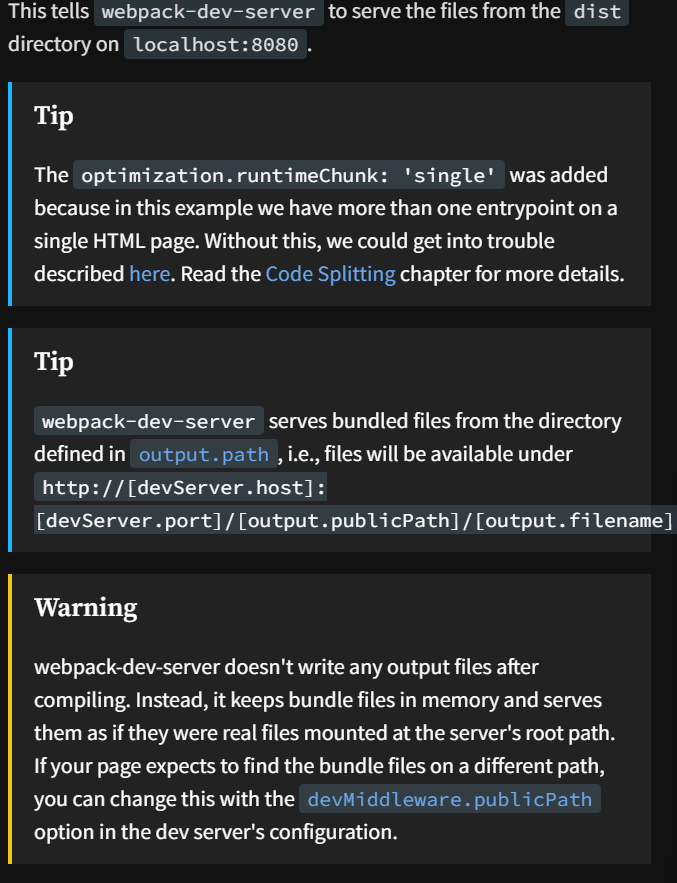

# Webpack

Webpack is a powerful module bundler for JavaScript applications. It takes modules with dependencies and generates static assets representing those modules. Webpack can transform, bundle, or package any resource or asset.

For more information and to get started, visit the [Webpack Getting Started guide](https://webpack.js.org/guides/getting-started/).

# Dev Server Optimization

The webpack-dev-server comes with many configurable options. Head over to the [documentation](https://webpack.js.org/configuration/dev-server) to learn more.

# Code Splitting
[Code splitting](https://webpack.js.org/guides/code-splitting/) is one of the most compelling features of webpack. This feature allows you to split your code into various bundles which can then be loaded on demand or in parallel. It can be used to achieve smaller bundles and control resource load prioritization which, if used correctly, can have a major impact on load time.

